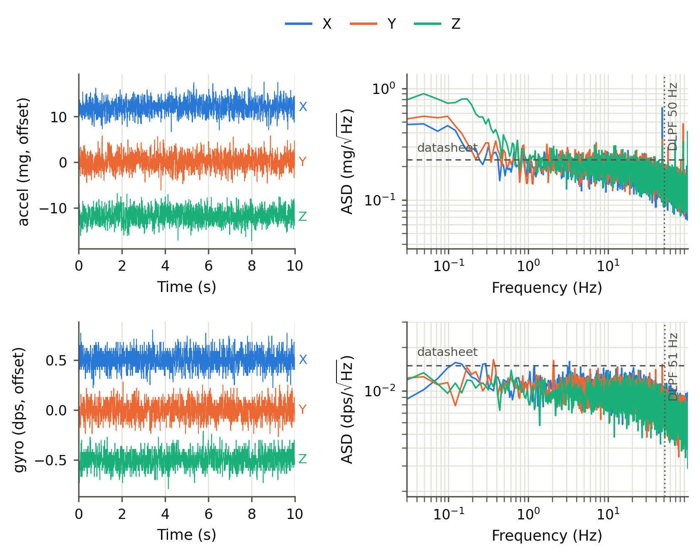

# DASH-01 IMU — measured properties

The robot's inertial sensor is the **ICM-20948** on a Waveshare **Sense HAT (B)**, bolted
underneath the base, read over I2C bus 1 by `fixed_gait/webui/sensehat.py`.

This document exists to be consumed by the **simulation model** (`../training/`): it is the sensor
the policy will actually get on hardware, and every figure below is labelled with where it came
from. Reproduce any of it with:

```
sudo systemctl stop runningrobot-webui        # it owns the bus; two owners corrupt the ICM's
python robot/fixed_gait/webui/tools/imu_bench.py --seconds 20    # bank-select state
sudo systemctl start runningrobot-webui
```

The noise figure (`results/imu_noise.png`, rendered by `tools/plot_imu_noise.py`) comes from a
300 s record captured the same way with `--seconds 300 --save /tmp/imu_noise_300s.npz`, scp'd to
`fixed_gait/webui/data/measurements/imu_noise_300s.npz` — the raw record is in the repo, so the
figure regenerates without the robot.

> **Provenance matters more than usual here.** A noise figure taken while the robot sways on its
> test rig measures the sway, and nothing in the number says so — that mistake once produced a
> yaw-axis "noise" 8x too high, and a low-pass sweep in which a *narrower* filter measured *more*
> noise. `imu_bench.py` now gates every noise figure on a motion check: vibration on the RMS,
> sway on the 1 s block means (a swaying robot *rotates* — the gyro block means are the sharp
> detector), bumps on the raw peak-to-peak measured against its own white-noise expectation.
> The peak-to-peak bound scales with record length on purpose: expected extremes grow as
> sqrt(2 ln n), so the original fixed 0.6 dps bound tripped on the first 300 s record while
> every sway statistic was clean (0.73 dps swing = 0.9x what white noise predicts for 60 000
> samples). Rows below are marked
> **[M]** measured at rest, **[M*]** measured but motion-independent (a mean, a rate, an LSB),
> **[D]** datasheet and not verified on this part, **[?]** not characterised.

## Configuration

Set in `sensehat.py` (`ICM20948` class attributes); change them there, not in the sim.

| | value | where |
|---|---|---|
| Accel range | ±4 g | `ACC_RANGE_G` |
| Gyro range | ±1000 dps | `GYR_RANGE_DPS` |
| Internal low-pass | DLPF cfg 3 | `DLPF_CFG` |
| Output data rate | 225 Hz nominal, **231 Hz actual** [M*] | `ODR_HZ` → `SMPLRT_DIV` |
| Poll / AHRS rate | 200 Hz | `IMU_HZ`, or `--imu-hz` |
| Magnetometer | AK09916 via I2C bypass, 100 Hz ODR, read at 25 Hz | `MAG_HZ` |

The ODR runs ~2.7% fast because the chip's 1125 Hz internal oscillator is untrimmed. It is above
the poll rate on purpose: poll faster than the ODR and reads simply return the previous sample.

## Accelerometer and gyroscope



*(2026-09-01, 300 s at rest on the stand. Left: raw traces, mean-removed and offset per axis.
Right: ASD against the datasheet density and the DLPF corner. The Allan-deviation statistics in
the table below come from the same record — `tools/plot_imu_noise.py` prints them; the panel was
dropped from the figure.)*

| | accel | gyro | |
|---|---|---|---|
| Resolution (1 LSB) | **0.1221 mg** (1/8192 g) | **0.0305 dps** (1/32.8) | [M*] confirmed: smallest observed step = exactly 1 LSB |
| 3 dB bandwidth | 50.4 Hz | 51.2 Hz | [D] DLPF cfg 3, rolloff visible in the ASD |
| Noise, RMS at rest | **1.56 / 1.68 / 1.67 mg** | **0.087 / 0.084 / 0.077 dps** | [M] 300 s record (a 20 s run read 1.7–1.9 mg — same part, shorter statistics) |
| → noise density | ~190 µg/√Hz | ~0.0097 dps/√Hz | [M] flat 1–30 Hz ASD band, vs [D] 230 µg/√Hz and 0.015 dps/√Hz — this part is at or better than spec |
| Turn-on bias | absorbed by the mount calibration | **[1.03, 0.11, −0.53] dps** | [M*] repeatable to ~0.1 dps across restarts (300 s run: [1.04, 0.15, −0.53]) |
| In-run bias stability | — | **0.008–0.012 dps** sd of 1 s averages | [M] |
| Bias instability (Allan floor) | **0.06–0.11 mg** at τ ≈ 40–50 s, Z worst | **0.0024 dps** (~8.6°/h) at τ ≈ 16–60 s | [M] 300 s record; the gyro floor implies yaw wander ~0.14°/min once the turn-on bias is zeroed |
| Scale error | **−0.03%** (\|a\| = 0.9997 g) | [?] | [M] |
| Cross-axis, non-linearity | [?] | [?] | not characterised |

The accel leaves the white-noise slope above τ ≈ 0.5 s — a slow, plausibly thermal drift
(strongest on Z, the gravity axis, which rules out stand sway: tilt shows up on the horizontal
axes at first order and on Z only at second). The gyro is textbook: white to its floor, no
excess low-frequency power. One narrow environmental line sits at **47.8 Hz on accel X**
(≈5x the floor, ~0.15 mg integrated — negligible; not 50 Hz mains, source unidentified).

**Quantisation sits ~15x below the noise floor on both channels.** Widening the ranges therefore
costs nothing in effective resolution — worth doing if footfall impacts start clipping ±4 g, which
they plausibly will. Gyro headroom is ample: ±1000 dps is 17453 dps of margin over anything the
legs do.

The magnetometer reads 0.15 µT/LSB, ±4900 µT. It is **not fused into the attitude** and should not
be modelled as a usable heading source: it sits centimetres from two brushless motors and the
battery, and its reading moves when they do.

## Timing and latency

| | value | |
|---|---|---|
| I2C bus clock | 100 kHz (Pi default, `dtparam` unset) | [M*] |
| accel+gyro+temp burst | **1.67 ms** (597 reads/s ceiling) | [M*] |
| + magnetometer | 2.64 ms (379 reads/s) | [M*] |
| Achieved poll rate, in service | **199.5 Hz** of 200 nominal | [M*] |
| Sample-to-sample jitter | sd 0.09 ms | [M*] |
| Occasional late ticks | ~4/s, gaps up to 8–12 ms | [M*] Linux scheduling, no RT kernel |

**Latency budget, sensor event → value published.** Model this: at a 5 ms control period it is
2–4 whole steps, which matters more than the noise.

| stage | delay | |
|---|---|---|
| DLPF group delay | ~5–10 ms | **[D], not measured** — the sweep meant to verify the bandwidth table was contaminated by robot motion. Treat as a range to randomise over. |
| ODR quantisation | 0–4.3 ms | [M*] 1/231 Hz |
| I2C read | 1.7 ms | [M*] |
| Poll period | 0–5 ms | [M*] |
| **total** | **~10–20 ms** | |

## Frames, mounting and lever arm

The HAT is mounted **underneath the base** — it reads gravity on chip **−Z**, so the chip frame and
the robot's body frame are nowhere near each other. `mountcal.py` measures the rotation rather than
asserting it (two captures: upright on the rig, then a nose-down tilt); see
`fixed_gait/webui/README.md` for the procedure and why the tilt capture is not optional.

For the sim, the parts that matter:

* **Body frame is X forward, Y left, Z up**, matching the MuJoCo model. Published values are in
  body axes once calibrated, raw chip axes before.
* **Mount rotation error** is currently the largest attitude uncertainty. It is bounded by the
  repeatability of the upright reference pose (±1–2° hung by eye), and the fore-aft axis is worse
  than that if the tilt capture was shallow — at a 4° tilt, 1° of unintended roll while tipping is
  **14°** of fore-aft error. Randomise the mount rotation by a few degrees, and the fore-aft axis
  by more until a 10–20° tilt capture has been done.
* **Lever arm.** The IMU is offset from the base centre, so it also measures
  `α×r + ω×(ω×r)` — zero at rest, significant while running. At 6 Hz footfall with ±5° of body
  pitch, the tangential term alone reaches ~1 g at r = 10 cm. The driver subtracts it when a lever
  is known (typed from CAD, or fitted by rocking). **Value: [?] — pending the CAD number.**

Effect on *attitude* of ignoring the lever entirely, measured in simulation with a known r: about
**0.3–0.5°** of extra error under low-frequency rocking (on a ~0.6° floor), because the attitude is
gyro-dominated and Madgwick's accel correction is rate-limited. Effect on the *raw acceleration* is
far larger — see above. Which of the two you consume decides how much r matters.

## The attitude filter

If the policy consumes roll/pitch rather than raw accel/gyro, **the sim must model the filter, not
just the sensor** — its dynamics dominate.

* 6-axis Madgwick (accel + gyro), `beta = 0.06` rad/s, running at the poll rate.
* Accel correction is **rate-limited to beta ≈ 3.4°/s** regardless of error size. The attitude is
  overwhelmingly gyro-driven; the accelerometer is a slow trim, not a measurement.
* **Roll and pitch are gravity-referenced and absolute. Yaw is pure gyro integration and drifts** —
  at the measured 0.011 dps in-run stability that is ~0.1°/10 s, but an *uncalibrated* turn-on bias
  of ~1 dps would be 10°/10 s. The gyro zero must be captured on a still robot each session.
* The filter is reset whenever the mount calibration changes (its quaternion lives in the old frame
  and a near-antipodal error sits on a saddle it never escapes).

## Not characterised

Flagged rather than guessed at:

* **Temperature dependence** of the gyro bias and accel scale. The die runs at 36–40 °C, ~13 °C
  above ambient, and warms during a session. The 300 s record now *bounds* the effect at rest:
  slow accel drift of 1.4–2.9 mg peak-to-peak over 5 min (Allan floor 0.06–0.11 mg), gyro clean —
  but the drift-vs-temperature *model* is still unmeasured.
* **Vibration rectification** under footfall impact — the classic MEMS failure mode for a legged
  robot, and the one most likely to bite.
* **Accel cross-axis sensitivity and non-linearity.**
* **DLPF group delay** on this part (see the latency table).
* **Clipping behaviour** at ±4 g during real impacts.

## Suggested sim2real sensor model

```python
IMU = dict(
    rate_hz=200.0,          # achieved 199.5; ~4 late ticks/s, gaps 8-12 ms  -> jitter, not dropout
    latency_s=(0.010, 0.020),   # randomise: DLPF group delay + ODR + I2C + poll period
    bandwidth_hz=51.0,      # low-pass the sim's true signal before sampling it
    accel=dict(
        range_g=4.0,        # CLIP at this, impacts may exceed it
        lsb_g=1.221e-4,     # quantise
        noise_density_g_rthz=190e-6,    # -> 1.6 mg RMS at this bandwidth; slow drift on top
                                        #    (up to ~3 mg over minutes, Allan floor 0.06-0.11 mg)
        scale_error=0.01,   # measured 0.0003; randomise wider for robustness
    ),
    gyro=dict(
        range_dps=1000.0,
        lsb_dps=0.0305,
        noise_density_dps_rthz=0.0096,  # -> 0.08 dps RMS at this bandwidth
        turn_on_bias_dps=1.0,           # per axis, re-zeroed each session but not perfectly
        in_run_bias_walk_dps=0.012,     # sd of a 1 s average
    ),
    mount=dict(
        rotation_error_deg=2.0,     # upright-pose repeatability
        fore_aft_error_deg=10.0,    # until a 10-20 deg tilt capture is done; then ~3
        lever_arm_m=None,           # base centre -> IMU, from CAD; adds alpha x r + w x (w x r)
    ),
    # If the policy reads fused attitude rather than raw accel/gyro, model the Madgwick filter
    # itself: beta = 0.06 rad/s, accel correction rate-limited to ~3.4 deg/s, yaw free-running.
    madgwick_beta=0.06,
)
```

Unmodelled and worth a robustness margin regardless: temperature drift, vibration rectification,
and the mount rotation being wrong in a *fixed* way rather than a random one.
